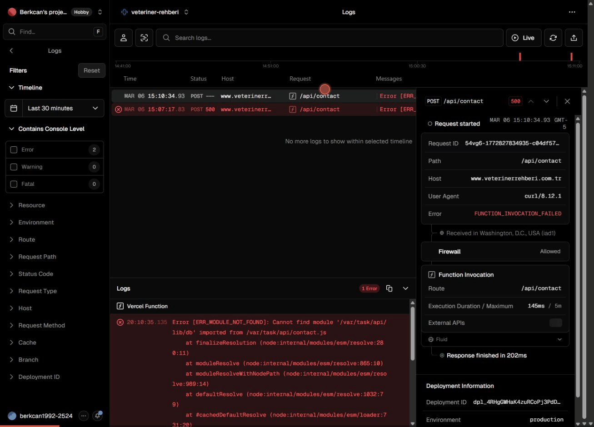

<div align="center">

# Rental Property Deal Analyzer

**Know if it's a good deal — before you buy.**

Free, open-source rental property investment calculator with AI-powered analysis.


[**Try the Live Demo**](https://rental-property-deal-analyzer.onrender.com)

<a href="https://buymeacoffee.com/bkapu"></a>
<a href="https://github.com/sponsors/berkcankapusuzoglu"></a>

</div>

<br>

<div align="center">
  
  <br>
  <em>One click from empty form to full investment analysis</em>
</div>

<br>

## What You Get

- **20+ investment metrics** calculated instantly (CoC, Cap Rate, DSCR, NOI, GRM, and more)
- **AI-powered analysis** — free local models or Claude API
- **Point-based deal scorecard** — 14-point system with factor-by-factor reasoning
- **5-year total return breakdown** — Cash Flow + Appreciation + Debt Paydown + Tax Benefits
- **Strategy fit analysis** — Cash Flow / Wealth Building / Low Risk / BRRRR
- **Save, compare, and export** — localStorage scenarios, side-by-side comparison (up to 3), PDF + HTML export
- **Zillow scraping** — auto-fill property data from a listing URL
- **Model selector** — switch between AI models on the fly

## Quick Start

### 1. Install

```bash
pip install -r requirements.txt
python -m playwright install chromium
```

### 2. Configure AI (optional)

```bash
cp .env.example .env
```

Choose your AI provider:

| Provider | Speed | Quality | Cost | Setup |
|----------|-------|---------|------|-------|
| **LM Studio** + qwen3.5-4b | ~30s | Excellent | Free | [Download LM Studio](https://lmstudio.ai) + load model |
| **LM Studio** + liquid/lfm2.5-1.2b | ~6s | Good | Free | [Download LM Studio](https://lmstudio.ai) + load model |
| **Ollama** + llama3.2:3b | ~7s | Good | Free | `ollama pull llama3.2:3b` |
| **Anthropic Claude** | ~5s | Excellent | ~$0.01/query | Set `ANTHROPIC_API_KEY` in `.env` |

**LM Studio** (recommended for GPU acceleration — works with AMD + NVIDIA via Vulkan):
```bash
AI_PROVIDER=lmstudio
```

**Ollama** (free, local):
```bash
AI_PROVIDER=ollama
OLLAMA_MODEL=llama3.2:3b
```

**Anthropic Claude** (paid, highest quality):
```bash
AI_PROVIDER=anthropic
ANTHROPIC_API_KEY=sk-ant-your-key-here
```

### 3. Run

```bash
python app.py
```

Opens automatically at **http://localhost:8000**. No build step required.

### Environment Variables

| Variable | Default | Description |
|----------|---------|-------------|
| `AI_PROVIDER` | `auto` | `auto`, `lmstudio`, `ollama`, or `anthropic` |
| `LMSTUDIO_URL` | `http://localhost:1234` | LM Studio server URL |
| `LMSTUDIO_MODEL` | _(auto)_ | Model ID from LM Studio |
| `OLLAMA_URL` | `http://localhost:11434` | Ollama server URL |
| `OLLAMA_MODEL` | `llama3.2:3b` | Any Ollama model name |
| `ANTHROPIC_API_KEY` | — | Required for Anthropic provider |

## How It Works

A **6-step wizard** guides you through the analysis:

1. **Property Info** — Address, price, type, ARV, rehab budget (or paste a Zillow URL)
2. **Financing** — Down payment, rate, term, points, closing costs (or toggle cash purchase)
3. **Income** — Monthly rent (multi-unit support), other income, growth rate
4. **Expenses** — Taxes, insurance, HOA, utilities, percentage-based costs, expense growth
5. **Review** — Summary of all inputs before calculating
6. **Results** — Full dashboard with metrics, projections, charts, and AI analysis

## Metrics Reference

### Core Metrics

| Metric | What It Means | Good Target |
|--------|---------------|-------------|
| **Monthly Cash Flow** | Rent minus ALL expenses (operating + mortgage) | > $100-200/unit |
| **Cash-on-Cash Return** | Annual cash flow / total cash invested | > 8% |
| **Cap Rate** | NOI / purchase price (financing-independent) | > 5-6% |
| **DSCR** | NOI / annual mortgage (debt coverage) | > 1.25 |
| **GRM** | Purchase price / annual rent | < 12-15 |
| **Break-Even Occupancy** | Min occupancy to cover all costs | < 85% |
| **OER** | Operating expenses / gross income | < 50% |
| **Annual Depreciation** | Building value / 27.5 years (IRS schedule) | Informational |

### The Four Pillars of Return

Real estate returns come from four sources, all calculated over a 5-year projection:

| Pillar | What It Is |
|--------|-----------|
| **Cash Flow** | Net rental income after all expenses and mortgage |
| **Appreciation** | Property value growth over time |
| **Debt Paydown** | Principal reduction — tenants pay down your loan |
| **Tax Benefits** | Depreciation deduction x your marginal tax rate |

### Deal Scorecard (14-Point System)

| Metric | 2 pts (Strong) | 1 pt (OK) | 0 pts (Weak) |
|--------|---------------|-----------|--------------|
| CoC Return | >= 8% | >= 4% | < 4% |
| Cap Rate | >= 6% | >= 4% | < 4% |
| DSCR | >= 1.25 | >= 1.0 | < 1.0 |
| CF per Unit/mo | >= $200 | >= $100 | < $100 |
| Break-even Occ. | <= 75% | <= 85% | > 85% |
| 1% Rule | Pass (2pts) | — | Fail (0pts) |
| 50% Rule | Pass (2pts) | — | Fail (0pts) |

**Verdict:** >= 75% = Great Deal | >= 45% = Borderline | < 45% = Pass

### Rules of Thumb

| Rule | Formula | Purpose |
|------|---------|---------|
| **1% Rule** | Monthly rent >= 1% of price | Quick cash flow filter |
| **50% Rule** | Operating expenses ~ 50% of rent | Expense reality check |
| **70% Rule** | Price + rehab <= 70% of ARV | BRRRR / flip viability |

### Strategy Fit

| Strategy | Key Metrics | What Makes It Work |
|----------|-------------|-------------------|
| **Cash Flow** | CoC >= 8%, CF/unit >= $200, DSCR >= 1.25 | High rent-to-price, low expenses |
| **Wealth Building** | 5yr total return, appreciation, equity growth | Growing markets, value-add |
| **Low Risk** | BEO < 75%, DSCR >= 1.5, 50% rule pass | Conservative margins |
| **BRRRR** | 70% rule pass, ARV spread | Below-market purchase + forced appreciation |

## Example Scenarios

### Good Deal — Cash Flow Rental

| | |
|---|---|
| **Property** | $250,000 single family, $2,800/mo rent |
| **Results** | Cash Flow: **$593/mo** · CoC: **9.83%** · Cap Rate: **8.92%** · DSCR: **1.47** |
| **Score** | **14/14 — Great Deal** |
| **5-Year Return** | **$104,189** (143.71% on $72,500 invested) |

### Mediocre Deal — Suburban, Thin Margins

| | |
|---|---|
| **Property** | $380,000 single family, $2,400/mo rent |
| **Results** | Cash Flow: **-$250/mo** · CoC: **-3.5%** · Cap Rate: **~4.7%** · DSCR: **~0.87** |
| **Score** | **~4-5/14 — Borderline** |
| **5-Year Return** | Positive (appreciation + debt paydown offset negative CF) |

### Bad Deal — Overpriced, Negative Cash Flow

| | |
|---|---|
| **Property** | $500,000, $2,000/mo rent (0.4% rule — far below 1%) |
| **Results** | Cash Flow: **-$1,690/mo** · CoC: **-17.6%** · DSCR: **~0.40** · BEO: **~176%** |
| **Score** | **2/14 — Pass** |
| **Why** | Mortgage alone ($2,797/mo) exceeds rent. Unsustainable. |

## Assumptions & Defaults

| Assumption | Default | Notes |
|-----------|---------|-------|
| Building value % | 80% | IRS land/building split for depreciation |
| Depreciation | 27.5 years straight-line | IRS residential schedule |
| Marginal tax rate | 25% | Adjust to your bracket |
| Vacancy | 8% | National avg 5-8% |
| Maintenance | 5% | Older properties may need 8-10% |
| CapEx reserve | 5% | Major replacements fund |
| Management | 10% | Set 0% if self-managing |
| Closing costs | 3% of price | Varies by state (1-5%) |
| Value growth | 3%/yr | U.S. historical avg |
| Income growth | 2%/yr | Conservative rent increases |
| Expense growth | 2%/yr | Roughly tracks CPI |
| Loan terms | 30yr fixed, 20% down, 7% | 2024-2025 rates |

**Not accounted for:** selling costs (6-8%), capital gains tax, depreciation recapture (25%), cost segregation, refinancing, PMI, rent-ready costs, legal/accounting fees.

## Tech Stack

- **Backend:** Python, FastAPI, uvicorn, httpx, BeautifulSoup, Playwright
- **Frontend:** Vanilla HTML/CSS/JS (single file, no frameworks, no build step)
- **AI:** LM Studio (free, GPU) / Ollama (free, local) / Anthropic Claude (paid, cloud)

## Zillow Scraping

Zillow aggressively blocks automated requests. The scraper tries httpx first, then Playwright headless Chromium as fallback. Both may still be blocked by CAPTCHA. When scraping fails, enter data manually — all fields are editable.

---

## Support the Project

If this tool helped you evaluate a deal, consider supporting its development:

<a href="https://buymeacoffee.com/bkapu">
  
</a>

Your support helps keep this project free and actively maintained.

---

## Contributing

See [CONTRIBUTING.md](CONTRIBUTING.md) for how to run locally and submit PRs.

## License

[MIT](LICENSE) — free to use, modify, and distribute.
